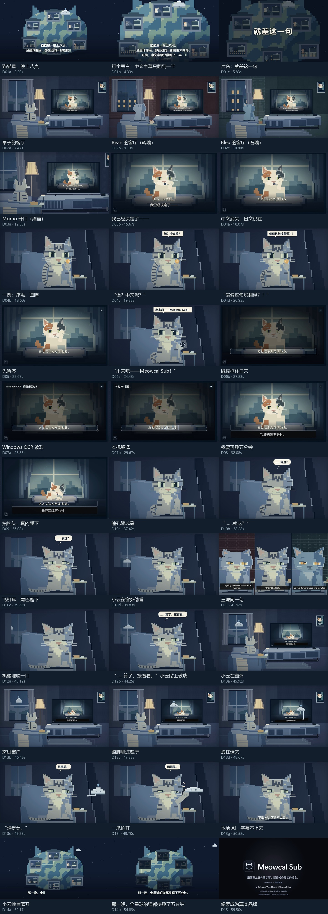
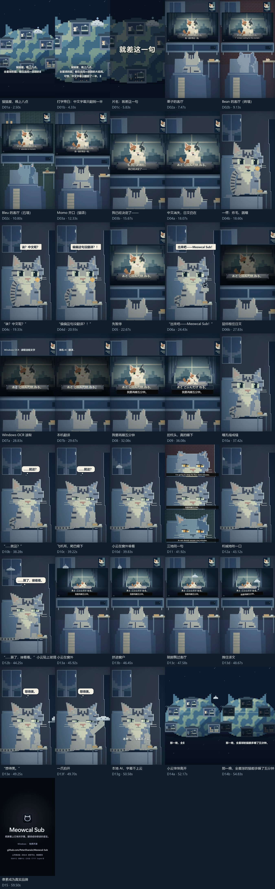
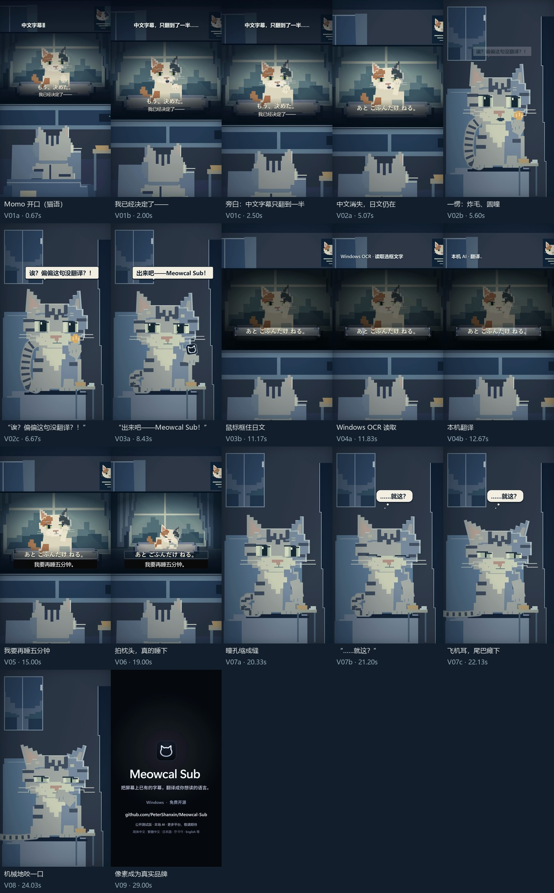
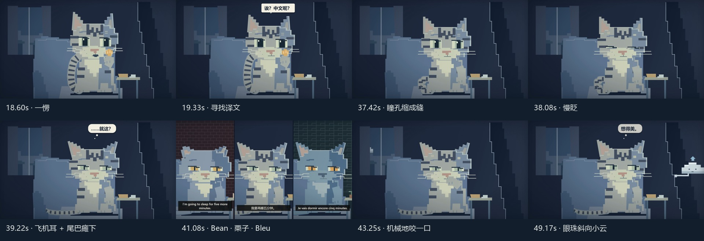

# 就差这一句 — 镜头联系表

导演脚本：[DIRECTOR_SCRIPT.md](DIRECTOR_SCRIPT.md)。联系表由 `scripts/drama_review.py` 从最终 MP4 提取，每个机位一帧。

## 60 秒横版

| 镜头 | 时间 | 内容 |
| --- | --- | --- |
| D01 | 0–6.7s | 打字旁白：猫猫星，晚上八点；全星球在追同一部剧；中文字幕只翻到一半。片名 |
| D02 | 6.7–11.7s | 三间客厅：栗子、Bean（砖墙）、Bleu（石墙） |
| D03 | 11.7–17.7s | Momo 开口，我已经决定了—— |
| D04 | 17.7–21.7s | 中文消失；一愣、炸毛：“诶？中文呢？”“偏偏这句没翻译？！” |
| D05 | 21.7–23.7s | 先暂停 |
| D06 | 23.7–28.7s | “出来吧——Meowcal Sub！”Logo 到掌心，框住日文 |
| D07 | 28.7–30.1s | OCR 读取 → 本机翻译 |
| D08 | 30.1–33.1s | 我要再睡五分钟 |
| D09 | 33.1–37.1s | 拍枕头、哈欠，真的睡下 |
| D10 | 37.1–40.1s | 瞳孔缩成缝 → 慢眨 →“……就这？”→ 飞机耳，尾巴瘫下；小云在窗外冒头 |
| D11 | 40.1–42.6s | 三分屏：Bean、栗子、Bleu，同一句英文、中文、法文 |
| D12 | 42.6–45.6s | 机械地咬一口：“……算了，接着看。”小云贴上玻璃 |
| D13 | 45.6–51.2s | 小云挤进窗户、踮脚过屋、拽译文；“想得美。”一爪拍开 |
| D14 | 51.2–55.5s | 小云飘走；那一晚，全星球的猫都多睡了五分钟，灯一盏盏熄灭 |
| D15 | 55.5–60s | 像素成为真实品牌 |

## 60 秒竖版

与横版同一剪辑、同一音轨，独立竖版构图。

## 30 秒竖版

| 镜头 | 时间 | 内容 |
| --- | --- | --- |
| V01 | 0–5s | 旁白：中文字幕只翻到一半；Momo 开口，我已经决定了—— |
| V02 | 5–8s | 中文消失；一愣：“诶？偏偏这句没翻译？！” |
| V03 | 8–12s | “出来吧——Meowcal Sub！”Logo 到掌心，框住日文 |
| V04 | 12–13s | OCR 读取 → 本机翻译 |
| V05 | 13–16s | 我要再睡五分钟 |
| V06 | 16–20s | 拍枕头、哈欠，真的睡下 |
| V07 | 20–23s | 瞳孔缩成缝 →“……就这？”→ 飞机耳，尾巴瘫下 |
| V08 | 23–25s | 机械地咬一口 |
| V09 | 25–30s | 像素成为真实品牌 |

## 表演检查

第一次停住：一愣、圆瞳、竖耳、尾巴炸毛竖直，然后寻找译文。第二次停住：瞳孔缩成缝、慢眨、半眯、飞机耳、胡须下垂，尾巴最后瘫下。三分屏里 Bean 与 Bleu 和栗子给出同样的半眯。承重爪、身体根节点与接触阴影保持固定。
